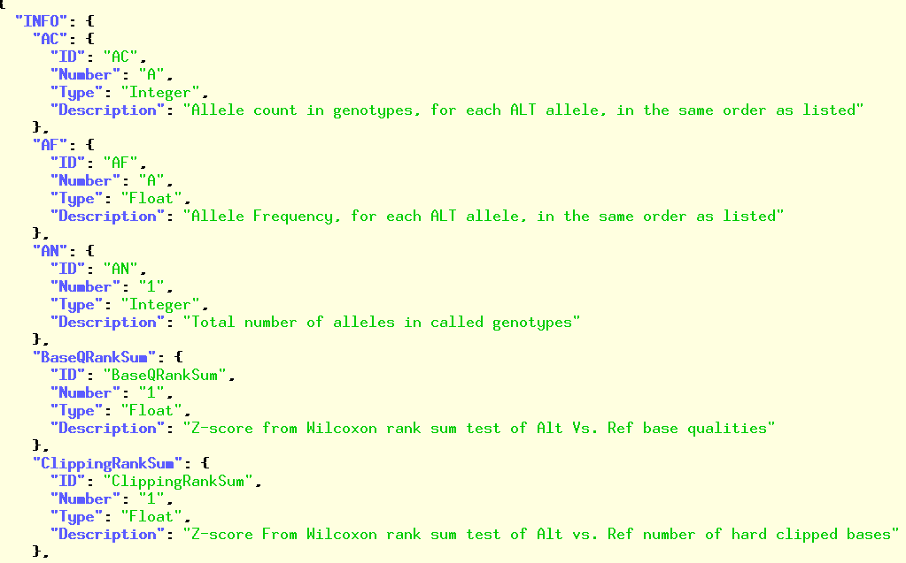

# bio-vcf

[](http://travis-ci.org/vcflib/bio-vcf) [](http://rubygems.org/gems/bio-vcf "Install with Rubygems") [](https://anaconda.org/bioconda/bio-vcf) [](https://anaconda.org/bioconda/bio-vcf)
[](https://packages.debian.org/testing/bio-vcf)

Quick index:

- [INSTALL](#Install)
- [Command line interface (CLI)](#command-line-interface-cli)
  + [Set analysis](#set-analysis)
  + [Genotype processing](#genotype-processing)
  + [Sample counting](#sample-counting)
  + [Filter with lambda](#reorder-filter-with-lambda)
  + [Modify VCF files](#modify-vcf-files)
  + [RDF output](#rdf-output)
- [Templates](#templates)
- [Metadata](#metadata)
- [Statistics](#statistics)
- [API](#api)
- [LICENCE](#LICENSE)
- [Cite](#CREDIT)


## Bio-vcf

Bio-vcf provides a domain specific language (DSL) for processing the
VCF format. Record named fields can be queried with regular
expressions, e.g.

```ruby
sample.dp>20 and rec.filter !~ /LowQD/ and rec.tumor.bcount[rec.alt]>4
```

Bio-vcf is a new generation VCF parser, filter and converter. Bio-vcf
is not only very fast for genome-wide (WGS) data, it also comes with a
really nice filtering, evaluation and rewrite language and it can
output any type of textual data, including VCF header and contents in
RDF and JSON.

So, why would you use bio-vcf over other parsers? Because

1. Bio-vcf is fast and scales on multi-core computers
2. Bio-vcf has an expressive filtering and evaluation language
3. Bio-vcf has great multi-sample support
4. Bio-vcf has multiple global filters and sample filters
5. Bio-vcf can access any VCF format
6. Bio-vcf can parse and query the VCF header (META data) and output as JSON



7. Bio-vcf can do calculations on fields
8. Bio-vcf allows for genotype processing
9. Bio-vcf has support for set analysis
10. Bio-vcf has sane error handling
11. Bio-vcf can convert *any* VCF to *any* output, including tabular data, BED, HTML, LaTeX, RDF, JSON and JSON-LD and even other VCFs by using (erb) templates
12. Bio-vcf has soft filters

Some examples are documented for [reducing GTeX](doc/GTEx_reduce.md),
[comparing GATK](doc/GATK_comparison.md), [comparing
VCFs](doc/Compare_VCFs.md), JSON [loading Mongo
database](doc/Using_Mongo.md), and [generating RDF](doc/Using_RDF.md).

## Options

In true Unix fashion files can be piped in or passed on the command
line:

    bio-vcf --help

```
bio-vcf 0.9.6 (biogem Ruby 2.7.2 with pcows) by Pjotr Prins 2015-2020
Usage: bio-vcf [options] filename
e.g.  bio-vcf < test/data/input/somaticsniper.vcf
    -i, --ignore-missing             Ignore missing data
        --filter cmd                 Evaluate filter on each record
        --sfilter cmd                Evaluate filter on each sample
        --sfilter-samples list       Filter on selected samples (e.g., 0,1
        --ifilter, --if cmd          Include filter
        --ifilter-samples list       Include set - implicitely defines exclude set
        --efilter, --ef cmd          Exclude filter
        --efilter-samples list       Exclude set - overrides exclude set
        --add-filter name            Set/add filter field to name
        --bed bedfile                Filter on BED elements
    -e, --eval cmd                   Evaluate command on each record
        --eval-once cmd              Evaluate command once (usually for header info)
        --seval cmd                  Evaluate command on each sample
        --rewrite eval               Rewrite INFO
        --samples list               Output selected samples
        --json                       Try to coerce header into JSON (also check out --template!)
        --rdf                        Try to coerce header into Turtle RDF (also check out --template!)
        --num-threads [num]          Multi-core version (default ALL)
        --thread-lines num           Fork thread on num lines (default 40000)
        --skip-header                Do not output VCF header info
        --set-header list            Set a special tab delimited output header (#samples expands to sample names)
    -t, --template erb               Use ERB template for output
        --add-header-tag             Add bio-vcf status tag to header output
        --timeout [num]              Timeout waiting for thread to complete (default 180)
        --names                      Output sample names
        --statistics                 Output statistics
    -q, --quiet                      Run quietly
    -v, --verbose                    Run verbosely
        --debug                      Show debug messages and keep intermediate output

        --id name                    Identifier
        --tags list                  Add tags
    -h, --help                       display this help and exit
```

## Performance

Bio-vcf has better performance than other tools because of lazy
parsing, multi-threading, and useful combinations of (fancy) command
line filtering. Adding cores, bio-vcf just
does better. The more complicated the filters, the larger the
gain. First a base line test to show IO performance

```sh
  time cat ESP6500SI-V2-SSA137.GRCh38-liftover.*.vcf|wc
  1987143 15897724 1003214613
  real    0m7.823s
  user    0m7.002s
  sys     0m2.972s
```

Next run this 1Gb data with bio-vcf effectively using 5 cores on AMD Opteron(tm) Processor 6174 using Linux

```sh
  time cat ESP6500SI-V2-SSA137.GRCh38-liftover.*.vcf|./bin/bio-vcf -iv --num-threads 8 --filter 'r.info.cp.to_f>0.3' > /dev/null
  real    0m32.491s
  user    2m34.767s
  sys     0m12.733s
```

The same with SnpSift v4.0 takes

```sh
time cat ESP6500SI-V2-SSA137.GRCh38-liftover.*.vcf|java -jar snpEff/SnpSift.jar filter "( CP>0.3 )" > /dev/null
real    12m36.121s
user    12m53.273s
sys     0m9.913s
```

This means that on this machine bio-vcf is 24x faster than SnpSift
even for a simple filter.  In fact, bio-vcf is perfect for complex
filters and parsing large data files on powerful machines. Parsing a
650 Mb GATK Illumina Hiseq VCF file and evaluating the results into a
BED format on a 16 core machine takes

```sh
  time bio-vcf --num-threads 16 --filter 'r.chrom.to_i>0 and r.chrom.to_i<21 and r.qual>50' --sfilter '!s.empty? and s.dp>20' --eval '[r.chrom,r.pos,r.pos+1]' < test.large2.vcf > test.out.3
  real    0m47.612s
  user    8m18.234s
  sys     0m5.039s
```

which shows decent core utilisation (10x). Running
gzip compressed VCF files of 30+ Gb has similar performance gains.

To view some complex filters on an 80Gb SNP file check out a
[GTEx exercise](https://github.com/vcflib/bio-vcf/blob/master/doc/GTEx_reduce.md).

Use zcat (or even better pigz which is multi-core itself) to pipe such
gzipped (vcf.gz) files into bio-vcf, e.g.

```sh
  zcat huge_file.vcf.gz| bio-vcf --num-threads 36 --filter 'r.chrom.to_i>0 and r.chrom.to_i<21 and r.qual>50'
    --sfilter '!s.empty? and s.dp>20'
    --eval '[r.chrom,r.pos,r.pos+1]' > test.bed
```

bio-vcf comes with a sensible parser definition language, an embedded Ragel parser for INFO and
FORMAT header definitions, as well as primitives for set analysis. Few
assumptions are made about the actual contents of the VCF file (field
names are resolved on the fly), so bio-vcf should work with all VCF
files.

To fetch all entries where all samples have depth larger than 20 and
filter set to PASS use a sample filter

```ruby
  bio-vcf --sfilter 'sample.dp>20 and rec.filter=="PASS"' < file.vcf
```

or with a regex

```ruby
  bio-vcf --sfilter 'sample.dp>20 and rec.filter !~ /LowQD/' < file.vcf
```

To only filter on some samples number 0 and 3:

```ruby
  bio-vcf --sfilter-samples 0,3 --sfilter 's.dp>20' < file.vcf
```

Where 's.dp' is the shorter name for 'sample.dp'.

It is also possible to specify sample names, or info fields:

For example, to filter somatic data

```ruby
  bio-vcf --filter 'rec.info.dp>5 and rec.alt.size==1 and rec.tumor.bq[rec.alt]>30 and rec.tumor.mq>20' < file.vcf
```

To output specific fields in tabular (and HTML, XML or LaTeX) format
use the --eval switch, e.g.,

```ruby
  bio-vcf --eval 'rec.alt+"\t"+rec.info.dp+"\t"+rec.tumor.gq.to_s' < file.vcf
```

In fact, if the result is an Array the output gets tab dilimited, so
the nicer version is

```ruby
  bio-vcf --eval '[r.alt,r.info.dp,r.tumor.gq.to_s]' < file.vcf
```

To output the DP values of every sample that has a depth larger than
100:

```ruby
bio-vcf -i --sfilter 's.dp>100' --seval 's.dp' < file.vcf

  1       10257   159     242     249     249     186     212     218
  1       10291   165     249     249     247     161     163     189
  1       10297   182     246     250     246     165     158     183
  1       10303   198     247     248     248     172     157     182
  (etc.)
```

Where -i ignores missing samples. Pick up sample allele depth

```ruby
bio-vcf -i --seval 's.ad.to_s'
1       10257   [151, 8]        [219, 22]       [227, 22]       [226, 22]       [166, 18]       [185, 27]  [201, 15]
1       10291   [145, 16]       [218, 26]       [214, 30]       [213, 32]       [122, 36]       [131, 27]  [156, 31]
1       10297   [155, 18]       [218, 23]       [219, 26]       [207, 30]       [137, 20]       [124, 27]  [151, 27]
1       10303   [169, 25]       [211, 31]       [214, 28]       [214, 32]       [146, 17]       [123, 23]  [156, 22]
```

To get the alt depth per sample

```ruby
bio-vcf -i --seval 's.ad[1]'
1       10257   8       22      22      22      18      27      15
1       10291   16      26      30      32      36      27      31
1       10297   18      23      26      30      20      27      27
1       10303   25      31      28      32      17      23      22
```

To calculate percentage non-reference (PNR) alt frequencies from s.ad
which is sample (alt dp)/(ref dp + alt dp)

```ruby
bio-vcf -i --seval 's.ad[1].to_f/(s.ad[0]+s.ad[1])'
1       10257   0.050314465408805034    0.0912863070539419      0.08835341365461848     0.088709677419354840.09782608695652174      0.12735849056603774     0.06944444444444445
1       10291   0.09937888198757763     0.10655737704918032     0.12295081967213115     0.1306122448979592 0.22784810126582278      0.17088607594936708     0.1657754010695187
```

note the floating point conversion .to_f is needed, otherwise you get
an integer division. To account for multiple alleles

```ruby
bio-vcf -i --eval 'r.ref+">"+r.alt[0]' --seval 'tot=s.ad.reduce(:+) ; (tot-s.ad[0].to_f)/tot' --set-header "mutation,#samples"
mutation        Original        s1t1    s2t1    s3t1    s1t2    s2t2    s3t2
A>C     0.050314465408805034    0.0912863070539419      0.08835341365461848     0.08870967741935484     0.09782608695652174 0.12735849056603774     0.06944444444444445
C>T     0.09937888198757763     0.10655737704918032     0.12295081967213115     0.1306122448979592      0.22784810126582278 0.17088607594936708     0.1657754010695187
```

To output DP ang GQ values for tumor normal:

```ruby
bio-vcf --filter 'r.normal.dp>=7 and r.tumor.dp>=5' --seval '[s.dp,s.gq]' < freebayes.vcf

  17      45235620        22      139.35  20      0
  17      45235635        20      137.224 14      41.5688
  17      45235653        18      146.509 12      146.509
  17      45247354        32      0       9       6.59312
  17      45247362        27      0       6       110.097

```

To parse and output genotype

```ruby
bio-vcf -iq --sfilter 's.dp>=20 and s.gq>=20' --ifilter-samples 's.gt!="0/0"' --seval s.gt < test/data/input/multisample.vcf
1       10257   0/0     0/0     0/0     0/0     0/0     0/1     0/0
1       10291   0/1     0/1     0/1     0/1     0/1     0/1     0/1
1       10297   0/1     0/1     0/1     0/0     0/0     0/1     0/1
1       12783   0/1     0/1     0/1     0/1     0/1     0/1     0/1
```

And use --set-header if you want to add a header

```ruby
bio-vcf -iq --set-header 'chr,pos,#samples' --sfilter 's.dp>=20 and s.gq>=20' --ifilter-samples 's.gt!="0/0"' --seval s.gt < test/data/input/multisample.vcf
chr     pos     orig   s1t1    s2t1    s3t1    s1t2    s2t2    s3t2
1       10257   0/0     0/0     0/0     0/0     0/0     0/1     0/0
1       10291   0/1     0/1     0/1     0/1     0/1     0/1     0/1
(etc)
```

where #samples gets expanded.

Most filter and eval commands can be used at the same time. Special set
commands exit for filtering and eval. When a set is defined, based on
the sample name, you can apply filters on the samples inside the set,
outside the set and over all samples. E.g.

So, why would you use bio-vcf instead of rolling out your own
Perl/Python/other ad-hoc script? I think the reason should be that
there is less chance of mistakes because of Bio-vcf's clear filtering
language and sensible built-in validation. The second reason would be
speed. Bio-vcf's multi-threading capability gives it great and hard to
replicate performance.

Also note you can use
[bio-table](https://github.com/pjotrp/bioruby-table) to
filter/transform data further and convert to other formats, such as
RDF.

The VCF format is commonly used for variant calling between NGS
samples. The fast parser needs to carry some state, recorded for each
file in VcfHeader, which contains the VCF file header. Individual
lines (variant calls) first go through a raw parser returning an array
of fields. Further (lazy) parsing is handled through VcfRecord.

At this point the filter is pretty generic with multi-sample support.
If something is not working, check out the feature descriptions and
the source code. It is not hard to add features. Otherwise, send a short
example of a VCF statement you need to work on.

## Install

Requirements:

* ruby

To install bio-vcf with Ruby gems, install Ruby first, e.g. on Debian
(as root)

```sh
apt-get install ruby
```

Installing ruby includes the `gem` command to install bio-vcf:

```sh
gem install bio-vcf
export PATH=/usr/local/bin:$PATH
bio-vcf -h
```

displays the help

```
bio-vcf x.x (biogem Ruby with pcows) by Pjotr Prins 2015-2020
Usage: bio-vcf [options] filename
e.g.  bio-vcf < test/data/input/somaticsniper.vcf
    -i, --ignore-missing             Ignore missing data
        --filter cmd                 Evaluate filter on each record
(etc.)
```

To install without root you may install a gem locally with

```sh
gem install --install-dir ~/bio-vcf bio-vcf
```

and run it with something like

```sh
~/bio-vcf/gems/bio-vcf-0.9.4/bin/bio-vcf -h
```

Finally, it is possible to checkout the git repository and simply
run the tool with

```sh
git clone https://github.com/vcflib/bio-vcf.git
cd bio-vcf
ruby ./bin/bio-vcf -h
```

## Command line interface (CLI)

Get the version of the VCF file

```ruby
  bio-vcf -q --eval-once header.version < file.vcf
  4.1
```

Get the column headers

```ruby
  bio-vcf -q --eval-once 'header.column_names.join(",")' < file.vcf
  CHROM,POS,ID,REF,ALT,QUAL,FILTER,INFO,FORMAT,NORMAL,TUMOR
```

Get the sample names

```ruby
  bio-vcf -q --eval-once 'header.samples.join(",")' < file.vcf
  NORMAL,TUMOR
```

Alternatively use the command line switch for --names, e.g.

```ruby
  bio-vcf --names < file.vcf
  NORMAL,TUMOR
```

Get information from the header (META) and print it as JSON (see image
at top of this text)

```ruby
  bio-vcf --eval-once 'header.meta' --json < gatk_exome.vcf
```

or get a single field

```ruby
  bio-vcf --eval-once 'header.meta["GATKCommandLine"]' --json < gatk_exome.vcf
```

Note that bio-vcf only outputs the HEADER as JSON with the --json
switch.  To get JSON output for the full VCF records use the
far more powerful --template option instead (see below).

The 'fields' array contains unprocessed data (strings).  Print first
five raw fields

```ruby
  bio-vcf --eval 'fields[0..4]' < file.vcf
```

Add a filter to display the fields on chromosome 12

```ruby
  bio-vcf --filter 'fields[0]=="12"' --eval 'fields[0..4]' < file.vcf
```

It gets better when we start using processed data, represented by an
object named 'rec'. Position is a value, so we can filter a range

```ruby
  bio-vcf --filter 'rec.chrom=="12" and rec.pos>96_641_270 and rec.pos<96_641_276' < file.vcf
```

The shorter name for 'rec.chrom' is 'r.chrom', so you may write

```ruby
  bio-vcf --filter 'r.chrom=="12" and r.pos>96_641_270 and r.pos<96_641_276' < file.vcf
```

To ignore and continue parsing on missing data use the
--ignore-missing (-i) and or --quiet (-q) switches

```ruby
  bio-vcf -i --filter 'r.chrom=="12" and r.pos>96_641_270 and r.pos<96_641_276' < file.vcf
```

Info fields are referenced by

```ruby
  bio-vcf --filter 'rec.info.dp>100 and rec.info.readposranksum<=0.815' < file.vcf
```

(alternatively you can use the indexed rec.info['DP'] and list INFO fields with
rec.info.fields).

Subfields defined by rec.format:

```ruby
  bio-vcf --filter 'rec.tumor.ss != 2' < file.vcf
```

Output

```ruby
  bio-vcf --filter 'rec.tumor.gq>30'
    --eval '[rec.ref,rec.alt,rec.tumor.bcount,rec.tumor.gq,rec.normal.gq]'
    < file.vcf
```

Show the count of the bases that were scored as somatic

```ruby
  bio-vcf --eval 'rec.alt+"\t"+rec.tumor.bcount.split(",")[["A","C","G","T"].index(rec.alt)]+
    "\t"+rec.tumor.gq.to_s' < file.vcf
```

Actually, we have a convenience implementation for bcount, so this is the same

```ruby
  bio-vcf --eval 'rec.alt+"\t"+rec.tumor.bcount[rec.alt].to_s+"\t"+rec.tumor.gq.to_s'
    < file.vcf
```

Filter on the somatic results that were scored at least 4 times

```ruby
  bio-vcf --filter 'rec.alt.size==1 and rec.tumor.bcount[rec.alt]>4' < test.vcf
```

Similar for base quality scores

```ruby
  bio-vcf --filter 'rec.alt.size==1 and rec.tumor.amq[rec.alt]>30' < test.vcf
```

Filter out on sample values

```ruby
  bio-vcf --sfilter 's.dp>20' < test.vcf
```

To filter missing on samples:

```sh
  bio-vcf --filter "rec.s3t2?" < file.vcf
```

or for all

```sh
  bio-vcf --filter "rec.missing_samples?" < file.vcf
```

To set a soft filter, i.e. the filter column is updated

```sh
bio-vcf --add-filter LowQD --filter 'r.tumor.dp<5' < test/data/input/somaticsniper.vcf |bio-vcf --eval '[r.chr,r.pos,r.tumor.dp,r.filter]' --filter 'r.filter.index("LowQD")'
```

may render something like

```
1       46527674        4       LowQD
1       108417572       4       LowQD
1       155449089       4       LowQD
1       169847826       4       LowQD
1       203098164       3       LowQD
2       39213209        4       LowQD
```

Likewise you can check for record validity

```sh
  bio-vcf --filter "not rec.valid?" < file.vcf
```

which, at this point, simply counts the number of fields.

If your samples have other names you can fetch genotypes for that
sample with

```sh
  bio-vcf --eval "rec.sample['Original'].gt" < file.vcf
```

Or read depth for another

```sh
  bio-vcf --eval "rec.sample['s3t2'].dp" < file.vcf
```

Better even, you can access samples directly with

```sh
  bio-vcf --eval "rec.sample.original.gt" < file.vcf
  bio-vcf --eval "rec.sample.s3t2.dp" < file.vcf
```

And even better because of Ruby magic

```sh
  bio-vcf --eval "rec.original.gt" < file.vcf
  bio-vcf --eval "rec.s3t2.dp" < file.vcf
```

Note that only valid method names in lower case get picked up this
way. Also by convention normal is sample 1 and tumor is sample 2.

Even shorter r is an alias for rec

```sh
  bio-vcf --eval "r.original.gt" < file.vcf
  bio-vcf --eval "r.s3t2.dp" < file.vcf
```

## Special functions

Note: special functions are not yet implemented! Look below
for genotype processing which has indexing in 'gti'.

Sometime you want to use a special function in a filter. For
example percentage variant reads can be defined as [a,c,g,t]
with frequencies against sample read depth (dp) as
[0,0.03,0.47,0.50]. Filtering would with a special function,
which we named freq

```sh
  bio-vcf --sfilter "s.freq(2)>0.30" < file.vcf
```

which is equal to

```sh
  bio-vcf --sfilter "s.freq.g>0.30" < file.vcf
```

To check for ref or variant frequencies use more sugar

```sh
  bio-vcf --sfilter "s.freq.var>0.30 and s.freq.ref<0.10" < file.vcf
```

For all includes var should be identical for set analysis except for
cartesian. So when --include is defined test for identical var and in
the case of cartesian one unique var, when tested.

ref should always be identical across samples.

## DbSNP

One clinical variant DbSNP example

```sh
    bio-vcf --eval '[rec.id,rec.chr,rec.pos,rec.alt,rec.info.sao,rec.info.CLNDBN]' < clinvar_20140303.vcf
```

renders

```
  1       1916905 rs267598254     A       3       Malignant_melanoma
  1       1916906 rs267598255     A       3       Malignant_melanoma
  1       1959075 rs121434580     C       1       Generalized_epilepsy_with_febrile_seizures_plus_type_5
  1       1959699 rs41307846      A       1       Generalized_epilepsy_with_febrile_seizures_plus_type_5|Epilepsy\x2c_juvenile_myoclonic_7|Epilepsy\x2c_idiopathic_generalized_10
  1       1961453 rs142619552     T       3       Malignant_melanoma
  1       2160299 rs387907304     G       0       Shprintzen-Goldberg_syndrome
  1       2160305 rs387907306     A       T       0       Shprintzen-Goldberg_syndrome,Shprintzen-Goldberg_syndrome
  1       2160306 rs387907305     A       T       0       Shprintzen-Goldberg_syndrome,Shprintzen-Goldberg_syndrome
  1       2160308 rs397514590     T       0       Shprintzen-Goldberg_syndrome
  1       2160309 rs397514589     A       0       Shprintzen-Goldberg_syndrome
```

## Set analysis

bio-vcf allows for set analysis. With the complement filter, for
example, samples are selected that evaluate to true, all others should
evaluate to false. For this we create three filters, one for all
samples that are included (the --ifilter or -if), for all samples that
are excluded (the --efilter or -ef) and for any sample (the --sfilter
or -sf). So i=include (OR filter), e=exclude and s=any sample (AND
filter).

The equivalent of the union filter is by using the --sfilter, so

```sh
  bio-vcf --sfilter 's.dp>20'
```

Filters DP on all samples and is true if all samples match the
criterium (AND). To filter on a subset you can add a
selector

```sh
  bio-vcf --sfilter-samples 0,1,4 --sfilter 's.dp>20'
```

For set analysis there are the additional ifilter (include) and
efilter (exclude).  Where sfilter represents an ALL match, the ifilter
represents an ANY match, i.e., it is true if one of the samples
matches the criterium (OR). To filter on samples 0,1,4 and output the gq
values

```sh
  bio-vcf -i --ifilter-samples 0,1,4 --ifilter 's.gq<10 or s.gq==99' --seval s.gq
    1       14907   99      99      99      99      99      99      99
    1       14930   99      99      99      99      99      99      99
    1       14933   1       99      99      39      99      99      99
    1       15190   99      99      91      99      99      99      99
    1       15211   99      99      99      99      99      99      99
```

The equivalent of the complement filter is by specifying what samples
to include, here with a regex and define filters on the included
 and excluded samples (the ones not in ifilter-samples) and the

```sh
  ./bin/bio-vcf -i --sfilter 's.dp>20' --ifilter-samples 2,4 --ifilter 's.gt==r.s1t1.gt'
```

To print out the GT's add --seval

```sh
  bio-vcf -i --sfilter 's.dp>20' --ifilter-samples 2,4 --ifilter 's.gt==r.s1t1.gt' --seval 's.gt'
    1       14673   0/1     0/1     0/1     0/1     0/1     0/1     0/1
    1       14907   0/1     0/1     0/1     0/1     0/1     0/1     0/1
    1       14930   0/1     0/1     0/1     0/1     0/1     0/1     0/1
    1       15211   0/1     0/1     0/1     0/1     0/1     0/1     0/1
    1       15274   1/2     1/2     1/2     1/2     1/2     1/2     1/2
    1       16103   0/1     0/1     0/1     0/1     0/1     0/1     0/1
```

To set an additional filter on the excluded samples:

```sh
  bio-vcf -i --ifilter-samples 0,1,4 --ifilter 's.gt==rec.s1t1.gt and s.gq>10' --seval s.gq --efilter 's.gq==99'
```

Etc. etc. Any combination of sfilter, ifilter and efilter is possible.
Currently the efilter is an ALL filter (AND), i.e. all excluded
samples need to match the criterium.

The following regular expression matches are not yet implemented:

In the near future it is also possible to select samples on a regex (here
select all samples where the name starts with s3)

```sh
  bio-vcf --isample-regex '/^s3/' --ifilter 's.dp>20'
```

```sh
  bio-vcf --include /s3.+/ --sfilter 'dp>20'  --ifilter 'gt==s3t1.gt' --efilter 'gt!=s3t1.gt'
--set-intersect  include=true
  bio-vcf --include /s3.+/ --sample-regex /^t2/ --sfilter 'dp>20'  --ifilter 'gt==s3t1.gt'
--set-catesian   one in include=true, rest=false
  bio-vcf --unique-sample (any) --include /s3.+/ --sfilter 'dp>20' --ifilter 'gt!="0/0"'
```

With the filter commands you can use --ignore-missing to skip errors.

## Genotype processing

The sample GT field counts 0 as the reference and numbers >1 as
indexed ALT values. The field is simply built up using a slash or | as
a separator (e.g., 0/1, 0|2, ./. are valid values). The standard field
results in a string value

```ruby
  bio-vcf --seval s.gt
    1       10665   ./.     ./.     0/1     0/1     ./.     0/0     0/0
    1       10694   ./.     ./.     1/1     1/1     ./.     ./.     ./.
    1       12783   0/1     0/1     0/1     0/1     0/1     0/1     0/1
    1       15274   1/2     1/2     1/2     1/2     1/2     1/2     1/2
```

to access components of the genotype field we can use standard Ruby

```ruby
  bio-vcf --seval 's.gt.split(/\//)[0]'
    1       10665   .     .     0     0     .     0     0
    1       10694   .     .     1     1     .     .     .
    1       12783   0     0     0     0     0     0     0
    1       15274   1     1     1     1     1     1     1
```

or special functions, such as 'gti' which gives the genotype as an
indexed value array

```ruby
  bio-vcf --seval 's.gti[0]'
    1       10665                   0       0               0       0
    1       10694                   1       1
    1       12783   0       0       0       0       0       0       0
    1       15274   1       1       1       1       1       1       1
```

and 'gts' as a nucleotide string array

```ruby
  bio-vcf --seval 's.gts'
    1       10665                   C       C               C       C
    1       10694                   G       G
    1       12783   G       G       G       G       G       G       G
    1       15274   G       G       G       G       G       G       G
```

where gts represents the indexed genotype on [ref] + [alt].

To convert combined genotypes into numbers, i.e., 0/0 -> 0, 0/1 -> 1,
1/1 -> 2, is useful for indexed fields giving information on, for
example signficance, use

```ruby
    bio-vcf --seval '!s.empty? and s.gtindex'
    11      58949455        0       1
    11      65481082        0       1
    11      94180424        0       1
    11      121036021       0       1
```

Now you can index other fields, e.g. GL

```ruby
    ./bin/bio-vcf --seval '[(!s.empty? ? s.gl[s.gtindex]:-1)]'
    1       900057  1.0     1.0     0.994   1.0     1.0     -1      0.999   1.0     0.997   -1  0.994    0.989   -1      0.991   -1      0.972   0.992   1.0
```

shows a number of SNPs have been scored with high significance and a
number are missing, here marked as -1.

These values can also be used in filters and output allele depth, for
example

```ruby
  bio-vcf -vi --ifilter 'rec.original.gt!="0/1"' --efilter 'rec.original.gt=="0/0"' --seval 'rec.original.ad[s.gti[1]]'
    1       10257   151     151     151     151     151     8       151
    1       13302   26      10      10      10      10      10      10
    1       13757   47      47      4       47      47      4       47
```

You can use the genotype index gti to fetch values from, for example,
allele depth:

```ruby
bio-vcf -vi --ifilter 'rec.original.gt!="0/1"' --efilter 'rec.original.gti[0]==0' --seval 'rec.original.ad[s.gti[1]]'

1       10257   151     151     151     151     151     8       151
1       13302   26      10      10      10      10      10      10
1       13757   47      47      4       47      47      4       47
```

## Sample counting

Note, the use of lambda allows for sophisticated queries. You may need
some expert advice here.

To count valid genotype field in samples you can do something like

```ruby
bio-vcf --eval 'r.samples.count {|s| s.gt!="./."}'
```

A similar complex count would be

```ruby
    bio-vcf --eval '[r.chr,r.pos,r.samples.count { |s| (!s.empty? && s.gl[s.gtindex]==1.0) }]'
```

which tests for perfect SNPs scored (for example).

## Reorder filter with lambda

Sometime it pay to reorder the filter using a lambda. This is one
example where the greedy sample counts are done only for those
samples that match the other criteria:

```ruby
./bin/bio-vcf --num-threads=1 --filter '(r.info.miss<0.05 and r.info.exp_freq_a1>0.05 and r.info.exp_freq_a1<0.95 and r.info.impinfo>0.7 and r.info.hw<1.0) ? lambda { found=r.samples.count { |s| (!s.empty? && s.gl[s.gtindex]==1.0) }.to_f; total=r.samples.count{|s| s.gt!="./."} ; found/total>0.7 and total-found<30 }.call : false)'
```

## Modify VCF files

Add or modify the sample file name in the INFO fields:

```sh
  bio-vcf --rewrite 'rec.info["sample"]="mytest"' < mytest.vcf
```

To remove/select 3 samples:

```sh
  bio-vcf --samples 0,1,3 < mytest.vcf
```

You can also select samples by name (as long as they do not contain
spaces)


```sh
  bio-vcf --names < mytest.vcf
    Original        s1t1    s2t1    s3t1    s1t2    s2t2    s3t2
  bio-vcf --samples "Original,s1t1,s3t1" < mytest.vcf
```


Filter on a BED file and annotate the gene name in the resulting VCF

```sh
  bio-vcf -v --bed test/data/input/test.bed --rewrite 'rec.info["gene"]=bed[3]' < test/data/input/somaticsniper.vcf
```

## RDF output

You can use --rdf for turtle RDF output from simple one-liners, note the use of --id and
--tags which includes the MAF record:

```ruby
bio-vcf --id evs --rdf --tags '{"db:evs" => true, "seq:freq" => rec.info.maf[0]/100 }' < EVS.vcf
  :evs_ch9_139266496_T seq:chr "9" .
  :evs_ch9_139266496_T seq:pos 139266496 .
  :evs_ch9_139266496_T seq:alt T .
  :evs_ch9_139266496_T db:vcf true .
  :evs_ch9_139266496_T db:evs true .
  :evs_ch9_139266496_T seq:freq 0.419801 .
```

Also check out the more powerful templating system below.

It is possible to filter too! Pick out the rare variants with

```ruby
bio-vcf --id evs --filter 'r.info.maf[0]<5.0' --rdf --tags '{"db:evs" => true, "seq:freq" => rec.info.maf[0]/100 }' < EVS.vcf
```

Similarly for GoNL

```ruby
bio-vcf --id gonl --rdf --tags '{"db:gonl" => true, "seq:freq" => rec.info.af }' < GoNL.vcf
```

or without AF


```ruby
bio-vcf --id gonl --rdf --tags '{"db:gonl" => true, "seq:freq" => (rec.info.ac.to_f/rec.info.an).round(2) }' < gonl_germline_overlap_r4.vcf
```

Also check out [bio-table](https://github.com/pjotrp/bioruby-table) to convert tabular data to RDF.

## Templates

To have more output options bio-vcf can use an [ERB
template](http://www.stuartellis.eu/articles/erb/) for every match. This is a
very flexible option that can output textual formats such as JSON, YAML, HTML
and RDF. Examples are provided in
[./templates](https://github.com/vcflib/bio-vcf/templates/). A JSON
template could be

```Javascript
{
  "seq:chr": "<%= rec.chrom %>" ,
  "seq:pos": <%= rec.pos %> ,
  "seq:ref": "<%= rec.ref %>" ,
  "seq:alt": "<%= rec.alt[0] %>" ,
  "seq:maf": <%= rec.info.maf[0] %> ,
  "dp":      <%= rec.info.dp %>
}
```

To get JSON, run with something like (combining
with a filter) and using the excellent [jq tool](https://shapeshed.com/jq-json/)

```sh
  bio-vcf --json --template template/vcf2json.erb --filter 'r.info.sao==1' < dbsnp.vcf |jq
```

which renders a pure JSON output

```Javascript
{
  "seq:chr": "13" ,
  "seq:pos": 35745475 ,
  "seq:ref": "C" ,
  "seq:alt": "T" ,
  "seq:maf": 0.0151 ,
  "dp":      86
}
```

Note that bio-vcf uses the template mechanism for full JSON output
because, in general, we only want to use a subset of the data for
further processing.  It makes little sense to create a full JSON dump.
The --json switch only makes sure we write a comma ',' between records.

Likewise for RDF output:

```sh
  bio-vcf --template template/vcf2rdf.erb --filter 'r.info.sao==1' < dbsnp.vcf
```

renders the ERB template

```ruby
<%
  id = Turtle::mangle_identifier(['ch'+rec.chrom,rec.pos,rec.alt.join('')].join('_'))
%>
:<%= id %>
  :query_id    "<%= id %>",
  seq:chr      "<%= rec.chrom %>" ,
  seq:pos      <%= rec.pos %> ,
  seq:ref      "<%= rec.ref %>" ,
  seq:alt      "<%= rec.alt[0] %>" ,
  seq:maf      <%= (rec.info.maf[0]*100).round %> ,
  seq:dp       <%= rec.info.dp %> ,
  db:vcf       true .
```

into something like these RDF triples

```
:ch13_33703698_A
  :query_id    "ch13_33703698_A",
  seq:chr      "13" ,
  seq:pos      33703698 ,
  seq:ref      "C" ,
  seq:alt      "A" ,
  seq:maf      16 ,
  seq:dp       92 ,
  db:vcf       true .
```

Note the calculated field value for maf. Be creative! You can write
templates for csv, HTML, XML, LaTeX, RDF, JSON, YAML, JSON-LD,
etc. etc.!

### Metadata

Templates can also print data as a header of the JSON/YAML/RDF output. For this
use the '=' prefix with HEADER, BODY, FOOTER keywords in the template. A small example
can be

```Javascript
=HEADER
<% require 'json' %>
{ "HEADER": {
    "options":  <%= options.to_h.to_json %>,
    "files":    <%= ARGV %>,
    "version":  "<%= BIOVCF_VERSION %>"
  },
  "BODY":[
=BODY
    {
      "seq:chr": "<%= rec.chrom %>" ,
      "seq:pos": <%= rec.pos %> ,
      "seq:ref": "<%= rec.ref %>" ,
      "seq:alt": "<%= rec.alt[0] %>" ,
      "dp":      <%= rec.info.dp %>
    },
=FOOTER
  ]
}
```

with

```sh
  bio-vcf --template template/vcf2json.erb < dbsnp.vcf
```

may generate something like

```Javascript
{ "HEADER": {
    "options":  {"show_help":false,"source":"https://github.com/CuppenResearch/bioruby-vcf","version":"0.8.1-pre3 (Pjotr Prins)","date":"2014-11-26 12:51:36 +0000","thread_lines":40000,"template":"template/vcf2json.erb","skip_header":true},
    "files":    [],
    "version":  "0.8.1-pre3"
  },
  "BODY":[
    {
      "seq:chr": "1" ,
      "seq:pos": 883516 ,
      "seq:ref": "G" ,
      "seq:alt": "A" ,
      "dp":
    },
    {
      "seq:chr": "1" ,
      "seq:pos": 891344 ,
      "seq:ref": "G" ,
      "seq:alt": "A" ,
      "dp": ,
    },
  ]
}
```

Note that the template is not smart enough to remove the final comma
from the last BODY element. To make it valid JSON that needs to be
removed. A future version may add a parameter to the BODY element or a
global rewrite function for this purpose. YAML and RDF have no such issue.

### Using full VCF header (meta) info

To get and put the full information from the header, simple use
vcf.meta.to_json.  See ./template/vcf2json_full_header.erb for an
example. This meta information can also be used to output info fields
and sample values on the fly! For an example, see the template at
[./template/vcf2json_use_meta.erb](https://github.com/vcflib/bio-vcf/tree/master/template/vcf2json_use_meta.erb)
and the generated output at
[./test/data/regression/vcf2json_use_meta.ref](https://github.com/vcflib/bio-vcf/tree/master/test/data/regression/vcf2json_use_meta.ref).

This way, it is possible to write templates that can convert the content of
*any* VCF file without prior knowledge to JSON, RDF, etc.

## Statistics

Simple statistics are available for REF>ALT changes:

```sh
./bin/bio-vcf -v --statistics < test/data/input/dbsnp.vcf
```

    ## ==== Statistics ==================================
      G>A             59      45%
      C>T             30      23%
      A>G              5       4%
      C>G              5       4%
      C>A              5       4%
      G>T              4       3%
      T>C              4       3%
      G>C              4       3%
      T>A              3       2%
      A>C              3       2%
      A>T              2       2%
      GTCCGACCGCTCC>G  1       1%
      CGACCGCTCC>C     1       1%
      T>TGGAGC         1       1%
      C>CGTCTTCA       1       1%
      TG>T             1       1%
      AC>A             1       1%

      Total          130
    ## ==================================================

## Other examples

For more exercises and examples see
[doc](https://github.com/vcflib/bio-vcf/tree/master/doc) directory
and the the feature
[section](https://github.com/vcflib/bio-vcf/tree/master/features).

## API

BioVcf can also be used as an API. The following code is basically
what the command line interface uses (see ./bin/bio-vcf)

```ruby
  FILE.each_line do | line |
    if line =~ /^##fileformat=/
      # ---- We have a new file header
      header = VcfHeader.new
      header.add(line)
      STDIN.each_line do | headerline |
        if headerline !~ /^#/
          line = headerline
          break # end of header
        end
        header.add(headerline)
      end
    end
    # ---- Parse VCF record line
    # fields = VcfLine.parse(line,header.columns)
    fields = VcfLine.parse(line)
    rec = VcfRecord.new(fields,header)
    #
    # Do something with rec
    #
  end
```

### VCFFile

The class ```BioVcf::VCFfile``` wraps a file and provides an ```enum``` with the
method each, that can be used as in iterator.

```ruby
vcf_file = "dbsnp.vcf"
vcf  = BioVcf::VCFfile.new(file:file, is_gz: false )
it vcf.each
puts it.peek

vcf_file = "dbsnp.vcf.gz"
vcf  = BioVcf::VCFfile.new(file:file, is_gz: true )
it vcf.each
puts it.peek
```

## Trouble shooting

### MRI supports threading

Note that Ruby 2.x is required for Bio-vcf. JRuby works, but only
in single threaded mode (for now).

### Set TMPDIR when running out of space

The multi-threading creates temporary files using the system TMPDIR.
This behaviour can be overridden by setting the environment variable.

### Reorder filter on time out

Make sure to minimize expensive calculations by moving them
backward. An 'and' statement is evaluated from left to right. With

```ruby
fast_check and slow_check
```

slow_check only gets executed if fast_check is true.

For more complex filters use lambda inside a conditional

```ruby
    ( fast_check ? lambda { slow_check }.call : false )
```

where slow_check is the slow section of your query. As is shown
earlier in this document. Don't forget the .call!

### Reduce thread lines on timeout

Depending on your input data and the speed filters it may be useful to
tweak the number of thread lines and/or to increase the timeout.

On really fast file systems for genome-wide sequencing try increasing
--thread-lines to a value larger than 100_000. On the other hand if
the computations are intensive (per line) reduce the number of
thread-lines (try 10_000 and 1_000).  If processes get killed that is
the one to try.

For larger files set the timeout to 600, or so. --timeout 600.

Different values may show different core use on a machine.

### Development

To run the tests from source

```sh
bundle install --path vendor/bundle
bundle exec rake
```

Note: we develop in a GNU Guix environment, see the header of
[guix.scm](guix.scm) which does not use bundler.

### Development/debugging

To debug output use the combination '-v --num-threads=1' for
generating useful output. Also do not use the -i switch (ignore
errors) when there are problems.

### Could not find rake-10.4.2 in any of the sources

Remove Gemfile.lock before running other tools.

### Tmpdir contains (old) bio-vcf directories

Multi-threaded bio-vcf writes into a temporary directory during
processing. When a process gets interrupted for some reason the
temporary directory may remain.

## Project home page

Information on the source tree, documentation, examples, issues and
how to contribute, see

  http://github.com/vcflib/bio-vcf

## LICENSE

This software is distributed under the free software [MIT LICENSE](./LICENSE).

## CREDIT

Citations are the bread and butter of Science.  If you are using this
software in your research and want to support our future work, please
cite the following publication:

Vcflib and tools for processing the VCF variant call format;
Erik Garrison, Zev N. Kronenberg, Eric T. Dawson, Brent S. Pedersen, Pjotr Prins;
doi: https://doi.org/10.1101/2021.05.21.445151

## Bibtex reference

```bibtex
@article {Garrison2021.05.21.445151,
	author = {Garrison, Erik and Kronenberg, Zev N. and Dawson, Eric T. and Pedersen, Brent S. and Prins, Pjotr},
	title = {Vcflib and tools for processing the VCF variant call format},
	elocation-id = {2021.05.21.445151},
	year = {2021},
	doi = {10.1101/2021.05.21.445151},
	publisher = {Cold Spring Harbor Laboratory},
	URL = {https://www.biorxiv.org/content/early/2021/05/23/2021.05.21.445151},
	eprint = {https://www.biorxiv.org/content/early/2021/05/23/2021.05.21.445151.full.pdf},
	journal = {bioRxiv}
}
```

If you use this software, or cite one of

* [BioRuby: bioinformatics software for the Ruby programming language](http://dx.doi.org/10.1093/bioinformatics/btq475)
* [Biogem: an effective tool-based approach for scaling up open source software development in bioinformatics](http://dx.doi.org/10.1093/bioinformatics/bts080)

## Biogems.info

This Biogem is published at (http://biogems.info/index.html#bio-vcf)

## Copyright

Copyright (c) 2014-2021 Pjotr Prins. See [LICENSE](./LICENSE) for further details.
